# 랜딩페이지 에디터
> Generated by [`prisma-markdown`](https://github.com/samchon/prisma-markdown)

- [default](#default)

## default

```mermaid
erDiagram
"Admin" {
  Int id PK
  String email UK
  String password
  String name
  String profileImage "nullable"
  String refreshToken "nullable"
  Int roleId FK
}
"Role" {
  Int id PK
  String name UK
  String description
}
"History" {
  Int id PK
  String description
  DateTime createdAt
  Int adminId FK
  Int siteId FK
  Int componentId FK "nullable"
  Int childId FK "nullable"
  Int mobileChildId FK "nullable"
}
"Child" {
  Int id PK
  String title "nullable"
  String content "nullable"
  Boolean isDelete
  Int componentId FK
}
"MobileChild" {
  Int id PK
  String title "nullable"
  String content "nullable"
  Boolean isDelete
  Int componentId FK
}
"Component" {
  Int id PK
  String name
  ComponentType componentType
  String title "nullable"
  String mobileTitle "nullable"
  String content "nullable"
  String mobileContent "nullable"
  Boolean isDelete
  Int siteId FK
}
"Footer" {
  Int id PK
  Int footerType
  String logo "nullable"
  String logoSize "nullable"
  String contentTop "nullable"
  String helpCenter "nullable"
  String terms "nullable"
  String contentBottom "nullable"
  String backgroundColor "nullable"
  String paddingTop "nullable"
  String paddingBottom "nullable"
  String textSize "nullable"
  String textColor "nullable"
  Float lineHeight "nullable"
  Int siteId FK,UK "nullable"
}
"MobileFooter" {
  Int id PK
  Int footerType
  String logo "nullable"
  String logoSize "nullable"
  String contentTop "nullable"
  String helpCenter "nullable"
  String terms "nullable"
  String contentBottom "nullable"
  String backgroundColor "nullable"
  String paddingTop "nullable"
  String paddingBottom "nullable"
  String textSize "nullable"
  String textColor "nullable"
  Float lineHeight "nullable"
  Int siteId FK,UK "nullable"
}
"Header" {
  Int id PK
  String logo "nullable"
  String logoSize "nullable"
  String height "nullable"
  String padding "nullable"
  String gap "nullable"
  String backgroundColor "nullable"
  String textSize "nullable"
  String textColor "nullable"
  Int siteId FK,UK "nullable"
}
"MobileHeader" {
  Int id PK
  String logo "nullable"
  String logoSize "nullable"
  String button "nullable"
  String buttonSize "nullable"
  String height "nullable"
  String padding "nullable"
  String menuPadding "nullable"
  String backgroundColor "nullable"
  String menuBackgroundColor "nullable"
  String textSize "nullable"
  String textColor "nullable"
  Int siteId FK,UK "nullable"
}
"Site" {
  Int id PK
  String domain UK
  String name
  String email
}
"ComponentStyle" {
  Int id PK
  String height "nullable"
  String padding "nullable"
  Int grid "nullable"
  String gap "nullable"
  String background "nullable"
  BackgroundType backgroundType
  Int componentId FK,UK
}
"ComponentMobileStyle" {
  Int id PK
  String height "nullable"
  String padding "nullable"
  Int grid "nullable"
  String gap "nullable"
  String background "nullable"
  BackgroundType backgroundType
  Int componentId FK,UK
}
"TitleStyle" {
  Int id PK
  String margin "nullable"
  String mobileMargin "nullable"
  String size "nullable"
  String mobileSize "nullable"
  Float lineHeight "nullable"
  Float mobileLineHeight "nullable"
  String color "nullable"
  String mobileColor "nullable"
  Int componentId FK,UK
}
"ContentStyle" {
  Int id PK
  String margin "nullable"
  String mobileMargin "nullable"
  String size "nullable"
  String mobileSize "nullable"
  Float lineHeight "nullable"
  Float mobileLineHeight "nullable"
  String color "nullable"
  String mobileColor "nullable"
  Int componentId FK,UK
}
"ChildStyle" {
  Int id PK
  String width "nullable"
  String height "nullable"
  String margin "nullable"
  String padding "nullable"
  String background "nullable"
  BackgroundType backgroundType
  String border "nullable"
  String borderRadius "nullable"
  String titleSize "nullable"
  String titleColor "nullable"
  Float titleLineHeight "nullable"
  String titleMargin "nullable"
  String contentSize "nullable"
  String contentColor "nullable"
  Float contentLineHeight "nullable"
  String contentMargin "nullable"
  Int childId FK,UK
}
"MobileChildStyle" {
  Int id PK
  String width "nullable"
  String height "nullable"
  String margin "nullable"
  String padding "nullable"
  String background "nullable"
  BackgroundType backgroundType
  String border "nullable"
  String borderRadius "nullable"
  String titleSize "nullable"
  String titleColor "nullable"
  Float titleLineHeight "nullable"
  String titleMargin "nullable"
  String contentSize "nullable"
  String contentColor "nullable"
  Float contentLineHeight "nullable"
  String contentMargin "nullable"
  Int mobileChildId FK,UK
}
"InquiryStyle" {
  Int id PK
  String padding "nullable"
  String gap "nullable"
  String textSize "nullable"
  String textColor "nullable"
  Float lineHeight "nullable"
  String backgroundColor "nullable"
  String buttonWidth "nullable"
  String buttonHeight "nullable"
  String buttonTextSize "nullable"
  String buttonTextColor "nullable"
  String buttonColor "nullable"
  String buttonRadius "nullable"
  Int componentId FK,UK
}
"MobileInquiryStyle" {
  Int id PK
  String padding "nullable"
  String gap "nullable"
  String textSize "nullable"
  String textColor "nullable"
  Float lineHeight "nullable"
  String backgroundColor "nullable"
  String buttonWidth "nullable"
  String buttonHeight "nullable"
  String buttonTextSize "nullable"
  String buttonTextColor "nullable"
  String buttonColor "nullable"
  String buttonRadius "nullable"
  Int componentId FK,UK
}
"_AdminToSite" {
  String A FK
  String B FK
}
"Admin" }o--|| "Role" : role
"History" }o--|| "Admin" : admin
"History" }o--|| "Site" : site
"History" }o--o| "Component" : component
"History" }o--o| "Child" : child
"History" }o--o| "MobileChild" : mobileChild
"Child" }o--|| "Component" : component
"MobileChild" }o--|| "Component" : component
"Component" }o--|| "Site" : site
"Footer" |o--o| "Site" : site
"MobileFooter" |o--o| "Site" : site
"Header" |o--o| "Site" : site
"MobileHeader" |o--o| "Site" : site
"ComponentStyle" |o--|| "Component" : component
"ComponentMobileStyle" |o--|| "Component" : component
"TitleStyle" |o--|| "Component" : component
"ContentStyle" |o--|| "Component" : component
"ChildStyle" |o--|| "Child" : child
"MobileChildStyle" |o--|| "MobileChild" : mobileChild
"InquiryStyle" |o--|| "Component" : component
"MobileInquiryStyle" |o--|| "Component" : component
"_AdminToSite" }o--|| "Admin" : Admin
"_AdminToSite" }o--|| "Site" : Site
```

### `Admin`

**Properties**
  - `id`: 
  - `email`: 
  - `password`: 
  - `name`: 
  - `profileImage`: 
  - `refreshToken`: 
  - `roleId`: 

### `Role`

**Properties**
  - `id`: 
  - `name`: 
  - `description`: 

### `History`

**Properties**
  - `id`: 
  - `description`: 
  - `createdAt`: 
  - `adminId`: 
  - `siteId`: 
  - `componentId`: 
  - `childId`: 
  - `mobileChildId`: 

### `Child`

**Properties**
  - `id`: 
  - `title`: 
  - `content`: 
  - `isDelete`: 
  - `componentId`: 

### `MobileChild`

**Properties**
  - `id`: 
  - `title`: 
  - `content`: 
  - `isDelete`: 
  - `componentId`: 

### `Component`

**Properties**
  - `id`: 
  - `name`: 
  - `componentType`: 
  - `title`: 
  - `mobileTitle`: 
  - `content`: 
  - `mobileContent`: 
  - `isDelete`: 
  - `siteId`: 

### `Footer`

**Properties**
  - `id`: 
  - `footerType`: 
  - `logo`: 
  - `logoSize`: 
  - `contentTop`: 
  - `helpCenter`: 
  - `terms`: 
  - `contentBottom`: 
  - `backgroundColor`: 
  - `paddingTop`: 
  - `paddingBottom`: 
  - `textSize`: 
  - `textColor`: 
  - `lineHeight`: 
  - `siteId`: 

### `MobileFooter`

**Properties**
  - `id`: 
  - `footerType`: 
  - `logo`: 
  - `logoSize`: 
  - `contentTop`: 
  - `helpCenter`: 
  - `terms`: 
  - `contentBottom`: 
  - `backgroundColor`: 
  - `paddingTop`: 
  - `paddingBottom`: 
  - `textSize`: 
  - `textColor`: 
  - `lineHeight`: 
  - `siteId`: 

### `Header`

**Properties**
  - `id`: 
  - `logo`: 
  - `logoSize`: 
  - `height`: 
  - `padding`: 
  - `gap`: 
  - `backgroundColor`: 
  - `textSize`: 
  - `textColor`: 
  - `siteId`: 

### `MobileHeader`

**Properties**
  - `id`: 
  - `logo`: 
  - `logoSize`: 
  - `button`: 
  - `buttonSize`: 
  - `height`: 
  - `padding`: 
  - `menuPadding`: 
  - `backgroundColor`: 
  - `menuBackgroundColor`: 
  - `textSize`: 
  - `textColor`: 
  - `siteId`: 

### `Site`

**Properties**
  - `id`: 
  - `domain`: 
  - `name`: 
  - `email`: 

### `ComponentStyle`

**Properties**
  - `id`: 
  - `height`: 
  - `padding`: 
  - `grid`: 
  - `gap`: 
  - `background`: 
  - `backgroundType`: 
  - `componentId`: 

### `ComponentMobileStyle`

**Properties**
  - `id`: 
  - `height`: 
  - `padding`: 
  - `grid`: 
  - `gap`: 
  - `background`: 
  - `backgroundType`: 
  - `componentId`: 

### `TitleStyle`

**Properties**
  - `id`: 
  - `margin`: 
  - `mobileMargin`: 
  - `size`: 
  - `mobileSize`: 
  - `lineHeight`: 
  - `mobileLineHeight`: 
  - `color`: 
  - `mobileColor`: 
  - `componentId`: 

### `ContentStyle`

**Properties**
  - `id`: 
  - `margin`: 
  - `mobileMargin`: 
  - `size`: 
  - `mobileSize`: 
  - `lineHeight`: 
  - `mobileLineHeight`: 
  - `color`: 
  - `mobileColor`: 
  - `componentId`: 

### `ChildStyle`

**Properties**
  - `id`: 
  - `width`: 
  - `height`: 
  - `margin`: 
  - `padding`: 
  - `background`: 
  - `backgroundType`: 
  - `border`: 
  - `borderRadius`: 
  - `titleSize`: 
  - `titleColor`: 
  - `titleLineHeight`: 
  - `titleMargin`: 
  - `contentSize`: 
  - `contentColor`: 
  - `contentLineHeight`: 
  - `contentMargin`: 
  - `childId`: 

### `MobileChildStyle`

**Properties**
  - `id`: 
  - `width`: 
  - `height`: 
  - `margin`: 
  - `padding`: 
  - `background`: 
  - `backgroundType`: 
  - `border`: 
  - `borderRadius`: 
  - `titleSize`: 
  - `titleColor`: 
  - `titleLineHeight`: 
  - `titleMargin`: 
  - `contentSize`: 
  - `contentColor`: 
  - `contentLineHeight`: 
  - `contentMargin`: 
  - `mobileChildId`: 

### `InquiryStyle`

**Properties**
  - `id`: 
  - `padding`: 
  - `gap`: 
  - `textSize`: 
  - `textColor`: 
  - `lineHeight`: 
  - `backgroundColor`: 
  - `buttonWidth`: 
  - `buttonHeight`: 
  - `buttonTextSize`: 
  - `buttonTextColor`: 
  - `buttonColor`: 
  - `buttonRadius`: 
  - `componentId`: 

### `MobileInquiryStyle`

**Properties**
  - `id`: 
  - `padding`: 
  - `gap`: 
  - `textSize`: 
  - `textColor`: 
  - `lineHeight`: 
  - `backgroundColor`: 
  - `buttonWidth`: 
  - `buttonHeight`: 
  - `buttonTextSize`: 
  - `buttonTextColor`: 
  - `buttonColor`: 
  - `buttonRadius`: 
  - `componentId`: 

### `_AdminToSite`
Pair relationship table between [Admin](#Admin) and [Site](#Site)

**Properties**
  - `A`: 
  - `B`: 